# 💊 MED-kit: The cure to your matrix deployment headaches

An easy way to deploy your own [Matrix](https://matrix.org) homeserver with reasonable defaults.

One script. A few questions. Your own communication infrastructure with the ability to federate. 

> ### Powered by awesome OSS technologies:
<table align="center"><tr>
  <td align="center"></td>
  <td align="center"></td>
  <td align="center"></td>
  <td align="center"></td>
  <td align="center"></td>
  <td align="center"></td>
</tr></table>


---

## ✨ What you get from the wizard

```mermaid
%%{init: {'theme': 'dark', 'themeVariables': { 'primaryColor': '#2dd4bf', 'edgeLabelBackground':'#134e4a', 'nodeTextColor':'#e0f2f1', 'fontFamily':'Inter', 'nodeBorderRadius':'12px', 'clusterBorderRadius':'16px', 'secondaryColor':'#5eead4', 'tertiaryColor':'#99f6e4', 'lineColor':'#5eead4'}}}%%
flowchart TD
    subgraph Server["Server"]
        direction TB
        Caddy["🔐 Caddy (TLS/Proxy)"]
        Element["💬 Element Web"]
        Synapse["🧠 Synapse (Matrix)"]
        PostgreSQL["🐘 PostgreSQL"]
        Redis["⚡ Redis Cache"]
        Coturn["🔁 Coturn (TURN)"]
        LiveKit["📡 LiveKit (SFU)"]
    end
    User["👤 User"]
    User ---|TLS| Caddy
    Caddy --- Synapse
    Caddy --- Element
    Caddy --- LiveKit
    Caddy --- Coturn
    Synapse --- PostgreSQL
    Synapse --- Redis
    Synapse --- LiveKit
    classDef teal fill:#2dd4bf,stroke:#5eead4,stroke-width:2px,color:#e0f2f1,rx:12px;
    classDef mint fill:#134e4a,stroke:#5eead4,stroke-width:2px,color:#e0f2f1,rx:12px;
    class Caddy,Synapse,Element,PostgreSQL,Redis,LiveKit,Coturn mint;
    class User mint;
    style Server stroke:#5eead4,stroke-width:4px,rx:16px,fill:#0f172a;
    style User stroke:#5eead4,stroke-width:2px,rx:12px;

```



After running `matrix-wizard.sh` you'll have a working Matrix homeserver — the whole stack, containerised and wired together:


| Service | What it does |
|---------|-------------|
|  **[Synapse](https://github.com/element-hq/synapse)** | The Matrix homeserver. Handles federation, rooms, messages. |
|  **[Element Web](https://github.com/element-web/element-web)** | The web client. Served at your domain so anyone can log in from a browser. |
|  **[Caddy](https://caddyserver.com)** | Reverse proxy. Handles TLS automatically via Let's Encrypt. |
|  **PostgreSQL** | Database for Synapse. Considerably more robust than SQLite for anything beyond a toy. |
|  **Redis** | Shared cache/event store for modules (Hookshot E2EE now, others later). |
| **[coturn](https://github.com/coturn/coturn)** | TURN server. Relays WebRTC traffic for 1:1 voice and video calls when both sides are behind NAT. |
|  **[LiveKit](https://livekit.io)** | SFU (Selective Forwarding Unit). Powers group video calls via Element Call and MatrixRTC. |

Everything runs in Docker Compose. Caddy manages your TLS certificate without you lifting a finger.

> ### 🔐 Bring your own login: Google, Microsoft, Github and more
>
> <table align="center">
>   <tr>
>     <td align="center"></td>
>     <td align="center"></td>
><td align="center"></td>
>   </tr>
> </table>
>
> The setup wizard currently supports **OIDC/OAuth2 SSO** out of the box — so users can sign in with **Google**, **Microsoft Entra ID**, or any other **OIDC-compatible provider**.

> ### 🔗 Bridge to other platforms: Whatsapp, Slack and more
>
> <table align="center">
>   <tr>
>     <td align="center"></td>
>     <td align="center"></td>
>     <td align="center"></td>
>   </tr>
> </table>
>
> The wizard supports auto-setup of **WhatsApp** and **Slack** as of now, but you can add more bridges manually through [following the documentation](https://docs.mau.fi/bridges). Keep an eye on this project for auto-setup of more bridges in future releases.


---

## Why does this exist?

Self-hosting Matrix is genuinely powerful — your own conversations, data, and server rules. But many "easy" setups expect you to:
- know what a reverse proxy is
- have a fair bit of patience for YAML
- copy environment variables and secrets around

This project makes setup even easier. It doesn't take power away from you — but rather sets things up correctly and then gets out of your way, so you can see exactly what's running and why.

---

## Requirements

- **A Linux server** with a public IP address (a cheap VPS works fine)
- **A domain name** pointed at that server (e.g. `matrix.example.com` → your server's IP)
- **Docker** (Engine 24+ recommended) — [install guide](https://docs.docker.com/engine/install/)
- **Docker Compose v2** — comes bundled with recent Docker Desktop and Docker Engine
- `curl`, `openssl`, `python3` — standard on most distributions

> **DNS first.** Make sure your DNS A record is live before running setup. Caddy needs to reach Let's Encrypt to issue your certificate, and that requires your domain to already be resolving.

---

## Quick start

```bash
git clone https://github.com/nordwestt/matrix-easy-deploy-kit
cd matrix-easy-deploy-kit
```

### Recommended workflow (YAML-first)

The primary operating model is:

1. Ensure host dependencies are installed.
2. Edit `deploy.yaml`.
3. Run `bash apply.sh`.
4. If you only want to render config without touching running containers, use `bash apply.sh --no-reconcile-runtime`.

For first-time setup on a fresh host, install dependencies non-interactively with:

```bash
bash ensure_dependencies.sh
```

Supported package managers are detected in this order: `apt-get`, `dnf`, then `pacman`.
Docker itself is installed through the official `get.docker.com` convenience script so Docker packaging differences stay delegated upstream.
If you want that to happen automatically before apply, use:

```bash
bash apply.sh --ensure-dependencies
```

Minimal flow:

```bash
# 1) Ensure host dependencies are present
bash ensure_dependencies.sh

# 2) Edit desired state
$EDITOR deploy.yaml

# 3) Converge generated artifacts, module state, and running services
bash apply.sh

# Or do dependency install + apply in one step
# bash apply.sh --ensure-dependencies

# Render/apply config only, without stop/start
# bash apply.sh --no-reconcile-runtime
```

By default, `bash apply.sh` also attempts non-interactive bootstrap for enabled modules when required generated files are missing.
To skip bootstrap:

```bash
bash apply.sh --skip-module-bootstrap
```

### Interactive wizard (optional UX)

```bash
bash matrix-wizard.sh
```

The wizard is a convenience layer over the same YAML-first model. It edits `deploy.yaml`, runs apply, and offers module/user/runtime shortcuts.

For first-time setup without the menu:

```bash
bash matrix-wizard.sh --full-setup
```

The wizard still checks dependencies, but `bash ensure_dependencies.sh` is the faster non-interactive path when you already know you want a standard install.

For unattended wizard automation, you can optionally set `ADMIN_PASSWORD` before `--full-setup`:

```bash
export ADMIN_PASSWORD='use-a-long-random-secret'
bash matrix-wizard.sh --full-setup
unset ADMIN_PASSWORD
```

Avoid storing `ADMIN_PASSWORD` in `.env` or `deploy.yaml`.

### Non-interactive setup from an existing `deploy.yaml`

If you already have a complete `deploy.yaml` and want to bootstrap the server without the interactive wizard, use this flow:

1. Apply the config. This also starts or reconciles the stack by default.
2. Wait for Synapse to become healthy.
3. Create the initial admin user non-interactively.

Example:

```bash
# 1. Render runtime files from deploy.yaml and reconcile runtime
bash apply.sh

# 2. Wait until Synapse is healthy
until [[ "$(docker inspect --format='{{.State.Health.Status}}' matrix_synapse 2>/dev/null)" == "healthy" ]]; do
  echo "Waiting for Synapse..."
  sleep 5
done

# 3. Load generated values and create the initial admin user
set -o allexport
source ./.env
set +o allexport

bash scripts/create-account.sh \
  --username "${ADMIN_USERNAME}" \
  --password 'replace-with-a-long-random-password' \
  --admin --yes
```

Notes:

- `bash apply.sh` now runs stop/start by default so generated config and running containers stay aligned.
- Use `bash apply.sh --no-reconcile-runtime` when you want render-only behavior.
- `scripts/create-account.sh` is safe to re-run; if the user already exists it will warn and skip.
- Keep the admin password out of `deploy.yaml` and `.env`. Pass it at execution time or inject it through your automation/secret manager.
- Enabled modules are bootstrapped non-interactively during `bash apply.sh` when their required generated config is missing.
- Bridge/module enable-disable transitions are reconciled by `bash apply.sh` by default; use `--no-reconcile-runtime` to skip the stop/start step.

### Smoke verification checklist

Run this after major changes or before release:

```bash
# 1) First apply should converge cleanly
bash apply.sh

# 2) Second apply should remain clean/idempotent
bash apply.sh

# 3) Runtime command coverage
bash stop.sh
bash start.sh
bash update.sh

# 4) Repeated module re-apply should not churn
bash matrix-wizard.sh --module hookshot
bash matrix-wizard.sh --module hookshot
bash matrix-wizard.sh --module whatsapp-bridge
bash matrix-wizard.sh --module whatsapp-bridge
bash matrix-wizard.sh --module slack-bridge
bash matrix-wizard.sh --module slack-bridge
```

### Uninstall/reset the stack

For repeatable test cycles, you can remove running services, Docker resources, and generated repository state while keeping `deploy.yaml`:

```bash
bash uninstall.sh
```

Non-interactive mode:

```bash
bash uninstall.sh --yes
```

This cleanup removes generated runtime files like `.env`, `.matrix-easy-deploy/`, rendered configs, and module data directories (`modules/core/synapse_data`, `modules/hookshot/hookshot`, `modules/whatsapp-bridge/whatsapp`, `modules/slack-bridge/slack`).

### Backups and restore (borgmatic, local repository)

Backups are configured in `deploy.yaml` under `backup`:

```yaml
backup:
  enabled: true
  repository:
    type: local
    path: /var/backups/med-kit
  schedule:
    enabled: false
    calendar: '*-*-* 03:00:00'
    persistent: true
  retention:
    keep_daily: 7
    keep_weekly: 4
    keep_monthly: 6
    keep_yearly: 0
```

The `keep_*` values are retention settings only. They tell Borg/Borgmatic how many archives to keep when `bash backup.sh` runs; they do not schedule automatic backups on their own.

If `backup.schedule.enabled` is true, `bash apply.sh` installs or updates a systemd timer that runs `bash backup.sh` automatically. `backup.schedule.calendar` is passed directly to systemd `OnCalendar`, and `backup.schedule.persistent` controls whether missed runs should fire after reboot.

Install prerequisites on the host:

```bash
sudo apt-get update
sudo apt-get install -y borgbackup borgmatic
```

Create a backup:

```bash
bash backup.sh
```

If scheduling is disabled, backups only run when you call `bash backup.sh` yourself. Enabling `backup.schedule` lets the repo manage a systemd timer for you.

To enable the built-in systemd timer, set `backup.schedule.enabled: true` and run:

```bash
bash apply.sh
```

Useful status commands:

```bash
systemctl status matrix-easy-deploy-backup.timer
systemctl list-timers matrix-easy-deploy-backup.timer
journalctl -u matrix-easy-deploy-backup.service
```

List available backups:

```bash
bash backup.sh --list
```

That command prints the archive names you can paste directly into restore.

Restore from an archive:

```bash
bash restore.sh --archive <archive-name>
```

For unattended or automation-driven restores, skip the destructive confirmation prompts with:

```bash
bash restore.sh --archive <archive-name> --yes
```

You can also pass a unique archive ID prefix from Borg's bracketed ID if you prefer, for example `bash restore.sh --archive 74125a60c0a4a76a`.

Behavior notes:

- `backup.sh` is a live backup: it leaves services running, takes a logical `pg_dump -Fc` of the Synapse PostgreSQL database, copies persisted project/module data, exports Caddy state volumes when present, and then runs borgmatic create/prune/check.
- `restore.sh` is destructive for runtime state: it stops services, extracts the selected archive, restores persisted state, re-runs `bash apply.sh`, restores the filesystem payload, recreates the Synapse database from the logical dump, re-runs `bash apply.sh`, and starts services unless you pass `--keep-stopped`.
- Generated runtime files such as `.env` and rendered service configs are not treated as canonical backup inputs; restore rebuilds them from `deploy.yaml` and `.matrix-easy-deploy` state.
- Existing logged-in sessions can keep showing rooms or messages that no longer exist on the restored server. Logging out and back in usually resolves that stale client state.
- For encrypted history on a new login, users typically need another verified session or their recovery key/secret storage. Registration tokens are unrelated to restoring message access after a rollback.
- This phase supports only local repository targets (`backup.repository.type: local`).

#### Portable export and restore (single file)

For moving hosts or off-site copies, export the same backup payload as a single compressed archive. Unencrypted archives contain full secrets (`deploy.yaml`, `secrets.yaml`, TLS state, database dumps) — use `--encrypt` for off-site storage.

Create a portable backup (updates the local Borg repo unless you pass `--export-only`):

```bash
bash backup.sh --export ~/med-kit-backup.tar.gz
bash backup.sh --export ~/med-kit-backup.tar.gz.age --encrypt
bash backup.sh --export-only ~/med-kit-backup.tar.gz   # stage + export, skip Borg
```

Re-export an older Borg snapshot without re-staging:

```bash
bash backup.sh --export-from-archive MED_Backup_2026-01-01T03:00:00 --export ~/snapshot.tar.gz
```

Restore from a portable file (no Borg repo required — works on a fresh clone):

```bash
bash restore.sh --file ~/med-kit-backup.tar.gz --yes
bash restore.sh --file ~/med-kit-backup.tar.gz.age --encrypt --yes
```

Fresh-host bootstrap:

```bash
git clone <repo> && cd matrix-easy-deploy
bash bootstrap-from-backup.sh ~/med-kit-backup.tar.gz.age --encrypt --yes
```

Encryption notes:

- Interactive `--encrypt` uses `age` (passphrase prompt).
- Set `MED_BACKUP_PASSPHRASE` for non-interactive export/restore (uses OpenSSL AES-256-CBC internally).
- Portable archives include Synapse DB dumps, bridge DB dumps when enabled, module state, Caddy volumes, and Tuwunel data when applicable.

### Run with Docker (single command)

If you prefer not to install local dependencies, run the wizard from the published container image:

```bash
mkdir -p ./med-kit
docker run --rm -it \
  -v /var/run/docker.sock:/var/run/docker.sock \
  -v "$(pwd)/med-kit:/workspace" \
  ghcr.io/nordwestt/matrix-easy-deploy-kit:release-latest
```

What this does:
- mounts Docker socket so the wizard can create/manage your Matrix containers on the host,
- mounts `./med-kit` so generated config and `.env` persist on your machine,
- opens the same interactive `matrix-wizard.sh` flow.

The wizard will ask you:

1. **Your Matrix domain** — something like `matrix.example.com`
2. **Your server name** — appears in Matrix IDs like `@you:example.com` (defaults to the base domain)
3. **Admin username and password**
4. Whether to allow public registration
5. Whether to enable federation
6. Whether to enable SSO (OIDC/OAuth2)
7. If SSO is enabled: one or more providers (loop: add provider, then optionally add another)
8. For each provider: name, issuer URL, client ID, client secret
9. For each provider: whether unknown users can auto-register via that provider
10. For each provider: optional OIDC claim allowlist (org/group/domain control)
11. Whether to install Element Web, and on which domain
12. **Your LiveKit domain** — something like `livekit.example.com` (defaults to `livekit.<basedomain>`)

### Configuration model

- `matrix.server_implementation` selects the homeserver software: `synapse` (default) or [`tuwunel`](https://github.com/matrix-construct/tuwunel) (Rust, lower resource use). Set this in `deploy.yaml` before the first `bash apply.sh`, or choose it in the setup wizard. **Switching implementation on an existing deployment is not supported** (no Synapse→Tuwunel migration yet).
- `deploy.yaml` is the operator-owned source of truth.
- `bash apply.sh` reads `deploy.yaml` and writes generated runtime artifacts (`.env`, rendered service configs, module state metadata).
- Re-running `bash apply.sh` is idempotent by default: existing generated secrets are re-used.
- `features.local_login_enabled: false` disables Synapse password login for SSO-only deployments. `bash apply.sh` rejects this unless SSO is enabled and at least one OIDC provider is configured.
- Enabled modules converge deterministically: if required generated files are missing, setup runs non-interactively.
- Bridge appservice registrations converge deterministically:
  - **Synapse**: enabled modules are synced into `modules/core/synapse_data` and added to `app_service_config_files`; disabled modules are removed from both.
  - **Tuwunel**: enabled modules are synced into `modules/core/tuwunel_data/appservices/` (Tuwunel `appservice_dir`); disabled modules are removed from that directory.
- Hookshot Caddy ingress converges deterministically:
  - enabled Hookshot ensures a managed Caddy block,
  - disabled Hookshot removes the managed Hookshot block.
- To rotate generated secrets intentionally, use:

```bash
bash apply.sh --rotate-secrets
```

> `--rotate-secrets` is destructive for existing deployments unless you plan migration/restart carefully.

### Synapse auto-join rooms

`features.synapse.auto_join` controls which rooms new users are joined to on registration, and whether those rooms are auto-created on first signup. Settings map to [Synapse auto-join configuration](https://element-hq.github.io/synapse/latest/usage/configuration/config_documentation.html#auto_join_rooms) in the generated `homeserver.yaml`.

- `rooms`: list of room or space aliases (for example `#welcome:example.com`). When empty, no auto-join block is written.
- `autocreate`: create listed rooms when the first user registers (default `true`).
- `autocreate_federated`: whether auto-created rooms are federated (default `true`).
- `room_preset`: `public_chat`, `private_chat`, or `trusted_private_chat` (default `public_chat`).
- `mxid_localpart`: localpart of the user that creates or invites to auto-join rooms; **required** for `private_chat` and `trusted_private_chat`.
- `rooms_for_guests`: auto-join guest accounts too (default `true`).

### Element Web customization

`features.element` exposes high-value org-facing Element Web options directly in `deploy.yaml`. `bash apply.sh` now writes `modules/core/element/config.json` from that YAML, so nested branding, support links, integrations, and home-page settings render as real JSON instead of string-substituted fragments.

Use first-class keys for common org needs:

- branding and login assets: `brand`, `default_theme`, `branding.*`
- login UX and SSO entry flow: `disable_custom_urls`, `disable_guests`, `disable_3pid_login`, `disable_login_language_selector`, `sso_redirect_options`
- support and compliance links: `help_url`, `help_encryption_url`, `help_key_storage_url`, `notice`, `terms_and_conditions`, `report_event`
- integrations and room discovery: `integrations`, `room_directory`
- feature gating: `labs`, `ui_features`
- advanced escape hatch: `extra_config` deep-merges last and wins on conflicts

Unset keys keep the repo defaults. Home and welcome customization is URL-only in this phase: host the HTML yourself and point Element at it.

Branded deployment example:

```yaml
features:
  element:
    brand: Acme Chat
    default_theme: dark
    help_url: https://docs.acme.example/chat
    branding:
      auth_header_logo_url: https://assets.acme.example/element/logo.svg
      welcome_background_url:
        - https://assets.acme.example/element/bg-1.jpg
        - https://assets.acme.example/element/bg-2.jpg
      auth_footer_links:
        - text: Support
          url: https://acme.example/support
        - text: Status
          url: https://status.acme.example/
    notice:
      title: Usage policy
      description: Company systems only. Activity may be reviewed.
      show_once: true
    terms_and_conditions:
      links:
        - text: Acceptable use
          url: https://acme.example/aup
```

SSO-first UX example:

```yaml
features:
  local_login_enabled: false
  sso:
    enabled: true
    providers:
      - name: Google
        issuer: https://accounts.google.com/
        client_id: your-client-id
        client_secret: your-client-secret
  element:
    disable_custom_urls: true
    ui_features:
      registration: false
      password_reset: false
    sso_redirect_options:
      on_welcome_page: true
      on_login_page: true
```

Custom home and welcome pages example:

```yaml
features:
  element:
    embedded_pages:
      home_url: https://assets.example.com/element/home.html
      welcome_url: https://assets.example.com/element/welcome.html
      login_for_welcome: false
```

Notes:

- For Element Desktop, your hosted `home.html` or `welcome.html` may need permissive CORS headers.
- To disable Scalar integrations entirely, set `features.element.integrations.enabled: false`.
- For less common Element settings, use `features.element.extra_config` to merge raw config into the generated JSON.

### Important: `MATRIX_DOMAIN` vs `SERVER_NAME`

- `MATRIX_DOMAIN` is where the homeserver API is hosted (for example `matrix.example.com`).
- `SERVER_NAME` is the Matrix identity domain in MXIDs (for example `@alice:example.com`).

If these are different, federation discovery still starts from `SERVER_NAME`, so DNS for **both** names must point to this host (or `SERVER_NAME` must otherwise serve `/.well-known/matrix/*` that delegates to your homeserver).

This project now generates Caddy config that serves Matrix endpoints on both hostnames automatically.

Everything else — database passwords, signing keys, TURN secrets, LiveKit API keys, internal secrets — is generated automatically. The wizard also auto-detects your server's public IP for coturn's NAT traversal configuration.

## SSO (OIDC / OAuth2)

This project configures Synapse `oidc_providers`, which works with Google and other OIDC-compatible identity providers.

To allow only SSO login, set this in `deploy.yaml`:

```yaml
features:
  local_login_enabled: false
  sso:
    enabled: true
    providers:
      - name: Google
        issuer: https://accounts.google.com/
        client_id: your-client-id
        client_secret: your-client-secret
```

This renders Synapse `password_config.enabled: false`. Local Matrix password login is disabled, so users must authenticate through one of the configured SSO providers.

During setup (default: enabled), provide:
- Provider display name (for login UI)
- OIDC issuer URL (Google: `https://accounts.google.com/`)
- OIDC client ID
- OIDC client secret
- Whether SSO can auto-register unknown users (default: **Yes** for frictionless onboarding)
- Optional claim allowlist (default: off; enable when you need tighter control)

You can configure multiple providers in one run (for example Google + Okta + Authentik).

When creating the OIDC app in your identity provider, set the redirect/callback URL to:

```text
https://<your-matrix-domain>/_synapse/client/oidc/callback
```

Example for Google:
- Create an OAuth client in Google Cloud Console
- Add the callback URL above as an authorized redirect URI
- Paste client ID + client secret into the setup wizard

### Restrict who can sign in (important)

To avoid “any Google user can join”, use one or both controls in the setup wizard:

1. Enable **Restrict SSO to specific OIDC claim values**
  - Result: only identities with matching claims are accepted by Synapse (`attribute_requirements`).
2. Set **Allow NEW users to auto-register via SSO?** to `No` (strict mode)
  - Result: only users you pre-create on Synapse can log in via SSO.

Common examples:

- **Google Workspace org only**: claim `hd`, allowed value `yourcompany.com`
- **Group allowlist**: claim `groups`, allowed value(s) like `matrix-users,admins`

How matching works in this setup:
- If you enter one allowed value, Synapse gets `value` matching.
- If you enter multiple comma-separated values, Synapse gets `one_of` matching.
- Matching is exact.

Generated behavior (conceptually):
- claim=`hd`, values=`acme.com` → `attribute_requirements: [{attribute: hd, value: acme.com}]`
- claim=`groups`, values=`matrix-users,admins` → `attribute_requirements: [{attribute: groups, one_of: [matrix-users, admins]}]`

### OIDC claim examples (what they do)

- `hd` (Google Workspace hosted domain)
  - Typical value: `yourcompany.com`
  - Use when: you only want users from your Google Workspace domain.
- `groups` (group membership; provider-specific)
  - Typical values: `matrix-users`, `admins`
  - Use when: you want role/group-based access control.
- `email`
  - Typical value: `alice@yourcompany.com`
  - Use when: you want a strict allowlist for specific email addresses.
- `tid` (Microsoft Entra tenant ID)
  - Typical value: tenant UUID
  - Use when: you only want users from one Entra tenant.
- `preferred_username` (provider-specific username/login)
  - Typical value: `alice`
  - Use when: provider issues stable usernames and you want to allow specific ones.

Notes:
- Group-based restrictions only work if your IdP actually includes group claims in OIDC userinfo/token.
- Claim matching is exact (or one-of exact values), so use the exact value your provider emits.
- Some claims (especially `groups`) may require extra scopes/provider config. This setup requests `openid profile email` by default.
- If your IdP already restricts users at the provider level (for example, Google OAuth app set to your org only), the default auto-registration flow is usually a good UX/security balance.

### Pre-creating approved users (what this means)

Pre-creating means creating local Matrix accounts in advance (for approved people only), then letting SSO users log into those existing accounts.

Advantages:
- Prevents surprise account creation from any user who can pass IdP login.
- Gives tighter onboarding control (who gets access and when).
- Lets you combine IdP checks + explicit local account approval for defense in depth.

Use the helper to create approved accounts:

```bash
bash scripts/create-account.sh
```

For unattended automation, you can also create a user non-interactively:

```bash
bash scripts/create-account.sh --username alice --password 'replace-with-a-long-random-password' --yes
```

To create an admin account, add the admin flag:

```bash
bash scripts/create-account.sh --username med-admin --password 'replace-with-a-long-random-password' --admin --yes
```

You can disable SSO in the wizard if you only want local Matrix passwords.
If password login is disabled, pre-created local accounts still exist in Synapse, but sign-in must still happen through configured SSO providers.

---

## Project layout

```
matrix-easy-deploy/
│
├── matrix-wizard.sh                      # The wizard. Start here.
├── start.sh                      # Bring everything back up
├── stop.sh                       # Bring everything down (data is preserved)
├── update.sh                     # Pull latest images and restart
│
├── caddy/
│   ├── docker-compose.yml        # Caddy service definition
│   ├── Caddyfile.template        # Routing template (rendered during setup)
│   └── Caddyfile                 # Generated — do not edit by hand
│
├── modules/
│   ├── core/                     # The core Matrix stack
│   │   ├── docker-compose.yml    # Synapse + Element + PostgreSQL + shared Redis
│   │   ├── synapse/
│   │   │   ├── homeserver.yaml.template
│   │   │   ├── homeserver.yaml   # Generated during setup
│   │   │   └── log.config
│   │   └── element/
│   │       ├── config.json.template
│   │       └── config.json       # Generated during setup
│   ├── calls/                    # Voice and video calling stack
│   │   ├── docker-compose.yml    # coturn + LiveKit
│   │   ├── coturn/
│   │   │   ├── turnserver.conf.template
│   │   │   └── turnserver.conf   # Generated during setup
│   │   └── livekit/
│   │       ├── livekit.yaml.template
│   │       └── livekit.yaml      # Generated during setup
│   ├── hookshot/                 # Hookshot bridge (webhooks, GitHub, feeds…)
│   │   ├── docker-compose.yml    # Hookshot service definition
│   │   ├── setup.sh              # Module setup wizard
│   │   └── hookshot/
│   │       ├── config.yml.template
│   │       ├── config.yml        # Generated during module setup
│   │       ├── registration.yml.template
│   │       ├── registration.yml  # Generated during module setup
│   │       └── passkey.pem       # Generated during module setup (keep private)
│   └── whatsapp-bridge/          # WhatsApp bridge (mautrix-whatsapp)
│       ├── docker-compose.yml    # Bridge service definition
│       ├── setup.sh              # Module setup wizard
│       └── whatsapp/
│           ├── config.yaml       # Generated during module setup
│           └── registration.yaml # Generated during module setup
│   └── slack-bridge/             # Slack bridge (mautrix-slack)
│       ├── docker-compose.yml    # Bridge service definition
│       ├── setup.sh              # Module setup wizard
│       └── slack/
│           ├── config.yaml       # Generated during module setup
│           └── registration.yaml # Generated during module setup
│
└── scripts/
    ├── lib.sh                    # Shared shell utilities
    ├── sso.sh                    # SSO/OIDC setup helpers (used by matrix-wizard.sh)
    ├── setup/                    # matrix-wizard.sh internals (modularized wizard steps)
    │   ├── banner.sh             # Intro banner output
    │   ├── dependencies.sh       # Dependency checks
    │   ├── config.sh             # Interactive configuration prompts
    │   ├── generate.sh           # Secrets + template rendering
    │   ├── runtime.sh            # Docker setup/start + admin bootstrap
    │   ├── summary.sh            # Final post-setup summary
    │   └── modules.sh            # --module dispatcher helper
    ├── med-admin.sh              # Thin wrapper for the med-admin Python CLI
    ├── med_admin.py              # Operator admin CLI (bootstrap/list/query/reset/rooms)
    └── create-account.sh         # Account registration helper (user or admin)
├── ensure_dependencies.sh       # Non-interactive host dependency installer
```

Modules live in `modules/`. The core stack is itself a module — bridges, bots, and other additions will each have their own directory under `modules/` with their own `docker-compose.yml` and `setup.sh`.

Redis is provisioned once in `modules/core` and exposed as a shared internal dependency (`matrix_redis`) so optional modules can reuse it without spinning up duplicate Redis containers.

By default, modules should use `SHARED_REDIS_URL` from `.env` and keep separation via Redis DB indexes and/or key prefixes.

### Redis conventions (tiny guide)

- **Single shared Redis**: use the core Redis instance (`matrix_redis`) unless a module has strict isolation needs.
- **Per-module DB index**: assign each module its own DB index (e.g. Hookshot uses `/1`, future modules can use `/2`, `/3`, ...).
- **Key prefixing**: if a module shares a DB, prefix keys with `<module>:` to avoid collisions.
- **Env-first wiring**: modules should read `SHARED_REDIS_URL` and derive module-specific URLs in their setup script.
- **Escalation rule**: split to dedicated Redis only when a module needs separate durability/SLO or creates noisy-neighbor risk.

---

## Common operations

**View logs**
```bash
docker logs -f matrix_synapse
docker logs -f caddy
docker logs -f matrix_element
docker logs -f matrix_postgres
docker logs -f matrix_redis
docker logs -f matrix_livekit
docker logs -f matrix_coturn
docker logs -f matrix-hookshot     # if hookshot module is installed
docker logs -f mautrix-whatsapp    # if whatsapp-bridge module is installed
docker logs -f mautrix-slack       # if slack-bridge module is installed
```

**Create an account (interactive)**
```bash
bash scripts/create-account.sh
```

The helper asks for a username, generates a secure temporary password by default (or lets you set a custom one), and can optionally grant admin privileges.

For non-interactive use, pass flags instead:

```bash
bash scripts/create-account.sh --username alice --password 'replace-with-a-long-random-password' --yes
```

To create an admin account non-interactively:

```bash
bash scripts/create-account.sh --username alice --password 'replace-with-a-long-random-password' --admin --yes
```

**Admin account operations with `med-admin`**

`med-admin.sh` is a command-line tool for bootstrapping and managing a dedicated operator admin account. After initial bootstrap, all admin commands work seamlessly without requiring credentials to be passed.

**Bootstrap a `med-admin` account** (one-time setup, automatic)

Create and store the dedicated admin account. The tool generates its own secure password:

```bash
bash scripts/med-admin.sh bootstrap
```

Optionally, you can specify a custom password:

```bash
bash scripts/med-admin.sh bootstrap --password 'replace-with-a-long-random-password'
```

This command:
1. Generates a secure password (or uses your custom one)
2. Creates the `med-admin` admin account via shared-secret registration
3. Stores both username and password in `.env` automatically
4. All subsequent admin commands use these stored credentials

**List all local accounts**

After bootstrap, commands work without additional credentials:

```bash
bash scripts/med-admin.sh list-accounts
```

With optional filtering and pagination:

```bash
bash scripts/med-admin.sh list-accounts --filter alice --limit 50
```

**List admins only**

```bash
bash scripts/med-admin.sh list-admins
```

**Query a specific account**

```bash
bash scripts/med-admin.sh get-account alice
```

**Reset a local account password**

```bash
bash scripts/med-admin.sh reset-password alice --password 'new-long-random-password' --yes
```

**Create a room (interactive)**

```bash
bash scripts/med-admin.sh create-room
```

This prompts for optional details and creates a private room by default if you do not choose public visibility.

**Create a room (non-interactive)**

```bash
bash scripts/med-admin.sh create-room \
  --name "Care Team" \
  --alias care-team \
  --topic "Clinical coordination" \
  --private \
  --invite alice \
  --invite @bob:example.com \
  --yes
```

Notes:
- `--name`, `--alias`, `--topic`, `--invite`, and `--direct` are optional.
- Visibility defaults to private when omitted (`--public` or `--private` can be passed explicitly).
- `--invite` accepts either usernames or full MXIDs and can be provided multiple times.

**How it works**

- `bootstrap` generates a secure password automatically and stores both username and password in `.env`
- All subsequent admin commands automatically use the stored `med-admin` credentials
- No need to pass credentials with each command
- If you need to use a different admin account, override with `--access-token` or `--admin-username`/`--admin-password`

**Important: SSO-only deployments**

If you have `features.local_login_enabled: false` in `deploy.yaml`:
- Bootstrap must happen **before** disabling password login
- Once password login is disabled, the stored credentials cannot be used to obtain new tokens
- If you hit this situation, obtain a token from elsewhere (e.g. temporarily re-enable password login, use Element's token export, or query Synapse directly) and pass it with `--access-token`

**Stop all services** (data stays intact in Docker volumes)
```bash
bash stop.sh
```

**Start all services**
```bash
bash start.sh
```

**Update images to the latest release**
```bash
bash update.sh
```

**Reload Caddy after editing the Caddyfile**
```bash
docker exec caddy caddy reload --config /etc/caddy/Caddyfile
```

---

## Re-applying configuration

If you need to change domains, feature flags, or module enablement:

1. Edit `deploy.yaml` directly or use `bash matrix-wizard.sh`.
2. Apply changes:

```bash
bash apply.sh
```

3. Restart services if needed:

```bash
bash stop.sh
bash start.sh
```

By default, `apply.sh` preserves existing generated secrets and re-renders files deterministically from `deploy.yaml`.
By default, `apply.sh` also runs stop/start to align running services with updated config. Use `apply.sh --no-reconcile-runtime` to skip that step.

Need migration details from legacy setup behavior? See `MIGRATION.md`.

---

## Adding modules

The project is designed to grow. Each optional component (a bridge to Discord, a Telegram bridge, a bot framework) lives in its own module under `modules/`. When a module is ready, you enable it with:

```bash
bash matrix-wizard.sh --module <module-name>
```

You can also install modules from the interactive wizard (`bash matrix-wizard.sh` → `Install/configure module`).

This updates module desired state in `deploy.yaml`, runs `apply.sh`, then calls the module's own `setup.sh` for module-specific bootstrap (tokens, registration, etc.).

### Available modules

#### `hookshot` — Bridges, webhooks, and feeds

[Hookshot](https://matrix-org.github.io/matrix-hookshot/latest/hookshot.html) connects your Matrix rooms to external services. Out of the box it enables:

| Feature | How to use |
|---------|------------|
| **Generic webhooks** | Invite `@hookshot` to a room, run `!hookshot webhook <name>` to get an inbound URL |
| **RSS/Atom feeds** | `!hookshot feed <url>` — posts new items to the room |
| **Encrypted rooms (E2EE)** | Supported out of the box (Hookshot crypto store + Redis cache + Synapse MSC3202/MSC2409 flags) |
| **GitHub** (optional) | Configure `github:` block in `config.yml`, re-run or restart |
| **GitLab** (optional) | Configure `gitlab:` block in `config.yml` |
| **Jira** (optional) | Configure `jira:` block in `config.yml` |

```bash
bash matrix-wizard.sh --module hookshot
```

The wizard will ask for a webhook domain (e.g. `hookshot.example.com`), generate the appservice tokens and RSA passkey, register Hookshot with Synapse, add a Caddy site block, and start the container automatically.

**DNS required:** add an A record for your hookshot domain before running the wizard.

**After setup:**
```bash
# View logs
docker logs -f matrix-hookshot

# Enable GitHub / GitLab / Jira — edit config.yml then:
docker restart matrix-hookshot
```

If you installed Hookshot before encrypted-room support was added, run `bash matrix-wizard.sh --module hookshot` once more to apply the new Redis and Synapse compatibility settings.

**Diagnose wiring issues** (checks registration, tokens, network, and does a live Synapse→Hookshot ping):
```bash
bash scripts/hookshot-check.sh
```

**Command caveats (common gotchas):**
- Room commands (`!hookshot ...`) require an unencrypted room unless Hookshot encryption support is configured.
- Give `@hookshot` enough power in the room (typically Moderator / PL50) so it can write room state.
- In DMs, `help` may look sparse if you have only webhooks/feeds enabled and no GitHub/GitLab/Jira auth features configured.

#### `whatsapp-bridge` — Bridge Matrix to WhatsApp

[mautrix-whatsapp](https://github.com/mautrix/whatsapp) lets you send and receive WhatsApp messages directly from your Matrix client. Your WhatsApp account is linked by scanning a QR code — no third-party service involved, everything runs on your own server.

| Feature | Notes |
|---------|-------|
| **1:1 chats** | All personal WhatsApp conversations appear as Matrix rooms |
| **Group chats** | WhatsApp groups bridged as Matrix rooms |
| **Media** | Images, video, voice messages, documents — all bridged both ways |
| **PostgreSQL** | Dedicated database created automatically during setup |

```bash
bash matrix-wizard.sh --module whatsapp-bridge
```

The wizard will ask for your Matrix admin username and relay mode preference, then handle everything: database creation, config generation, appservice registration with Synapse, and starting the container.

**After setup:**
1. Open a DM with `@whatsappbot:<your-server>` in Element
2. Send `login`
3. Scan the QR code in WhatsApp → Linked Devices → Link a Device
4. Your chats will start appearing as Matrix rooms

```bash
# View logs
docker logs -f mautrix-whatsapp

# Re-link after logging out of WhatsApp
# (DM @whatsappbot and send 'login' again)

# Restart
docker restart mautrix-whatsapp
```

> **Note:** Your WhatsApp mobile app must stay active. If you factory-reset your phone or uninstall WhatsApp, re-run `login` in the bridge DM to re-link.

#### `slack-bridge` — Bridge Matrix to Slack

[mautrix-slack](https://github.com/mautrix/slack) lets you send and receive Slack messages directly from your Matrix client. Your Slack account is linked using a token and cookie from the Slack web app — no third-party service involved, everything runs on your own server.

| Feature | Notes |
|---------|-------|
| **1:1 chats** | All personal Slack DMs appear as Matrix rooms |
| **Channels** | Slack channels bridged as Matrix rooms |
| **Media** | Images, files — all bridged both ways |
| **PostgreSQL** | Dedicated database created automatically during setup |

```bash
bash matrix-wizard.sh --module slack-bridge
```

The wizard will ask for your Matrix admin username, then handle everything: database creation, config generation, appservice registration with Synapse, and starting the container.

**After setup:**
1. Open a DM with `@slackbot:<your-server>` in Element
2. Send `login token <xoxc-token> <xoxd-cookie>`
3. Your Slack chats will start appearing as Matrix rooms

**Getting your Slack token and cookie:**
1. Login to Slack in your browser
2. Open browser devtools → Application → Local Storage
3. Find `localConfig_v2` → teams → your team → token (starts with `xoxc-`)
4. The `d` cookie (starts with `xoxd-`) is under Cookies for slack.com

```bash
# View logs
docker logs -f mautrix-slack

# Restart
docker restart mautrix-slack
```

More modules coming. Watch this space.

---

## Troubleshooting

**Caddy can't get a certificate**

Usually a DNS issue. Check that your domain resolves to your server's IP:
```bash
dig +short matrix.example.com
```
If it doesn't match, wait for DNS to propagate and try again. Caddy logs all certificate activity:
```bash
docker logs caddy
```

**1:1 calls fail or audio/video cuts out**

This is almost always a TURN / NAT traversal issue. Check that ports 3478 and 5349 (as well as the UDP relay range 49152–49400) are open in your firewall or VPS security group. Verify coturn is running:
```bash
docker logs matrix_coturn
```
If your VPS is behind a cloud NAT (e.g. AWS, GCP), make sure `external-ip` in `modules/calls/coturn/turnserver.conf` is set to your actual public IP, not the NAT gateway IP.

**Group calls (Element Call) don't connect**

Check that LiveKit is running and that your `livekit.example.com` DNS record is resolving:
```bash
docker logs matrix_livekit
curl -I https://livekit.example.com
```
Also make sure port range 50000–50100/UDP is open in your firewall.

**Synapse takes a long time to start**

On first boot, Synapse runs database migrations. If your VPS is modest, give it a minute or two. The setup wizard polls every 5 seconds and will wait up to 3 minutes.

**The admin user wasn't created**

If Synapse wasn't responding in time, the wizard prints the manual command:
```bash
bash scripts/create-account.sh \
  --username admin \
  --password <your_password> \
  --admin --yes
```
The `REGISTRATION_SHARED_SECRET` is in your `.env` file.

**Synapse reports database connection errors**

Make sure the `matrix_postgres` container is healthy before Synapse tries to connect. You can check:
```bash
docker inspect matrix_postgres | grep -A 5 Health
```

---

## Security notes

- Your `.env` file and `.matrix-easy-deploy/secrets.yaml` contain database credentials, TURN secrets, LiveKit API keys, and other internal secrets. Keep both private and out of git.
- Public registration is off by default. Think carefully before turning it on; an open Matrix server is a spam target.
- OIDC SSO is on by default in the wizard. If you don't want external IdPs, disable SSO during setup.
- Federation is on by default. If you want a private, islands-only server, disable it during setup.
- The Synapse admin API (`/_synapse/admin/`) is accessible via Caddy. It requires a valid admin access token to use — the setup just exposes the routing; auth is Synapse's business.
- coturn runs with `network_mode: host` so it can bind UDP relay ports directly. Ensure your firewall allows:
  - TCP/UDP 3478 (TURN)
  - TCP/UDP 5349 (TURN over TLS)
  - UDP 49152–49400 (TURN relay range)
  - UDP 50000–50100 (LiveKit WebRTC media; bound on the host, not via docker-proxy)

---

## Contributing

Issues, fixes, and module contributions are welcome. If you're adding a new module, follow the pattern in `modules/core/` — a `docker-compose.yml` for services and a `setup.sh` that sources `scripts/lib.sh` for prompts and helpers.

## Verification (local-dev friendly)

You can validate logic and idempotency on a local laptop without a full server deployment.

Install test dependencies once (pytest gives a quiet summary by default; unittest is used as a fallback):

```bash
pip install -r requirements-dev.txt
```

Use `./test` (recommended). It sets `PYTHONPYCACHEPREFIX=.pycache` so bytecode is not written under `tests/__pycache__/` — that avoids a common pitfall where `python -m unittest tests/*` tries to load `tests/__pycache__` as a test module.

```bash
# All unit tests (quiet)
./test

# Verbose / single file / filter by name
./test -v
./test tests/test_apply.py
./test -k caddy

# unittest directly (use discover, not tests/* glob)
PYTHONPYCACHEPREFIX=.pycache python -m unittest discover -s tests -p 'test_*.py'

# Deterministic apply run with fixed IP for local smoke checks
bash apply.sh --server-ip 127.0.0.1

# Optional: verify repeated apply is stable
bash apply.sh --server-ip 127.0.0.1
```

For release confidence, run these checks before shipping changes to setup/apply/module scripts.

## Releasing

Automated multi-channel releasing is configured via GitHub Actions.

- Push to the `release` branch to trigger a release run.
- The pipeline publishes GitHub Release assets and GHCR images by default.
- Docker Hub and Homebrew publishing are enabled automatically when their repository secrets are configured.

See `RELEASING.md` for setup details and required secrets.

---

## Licence

MIT. Do what you like with it.
